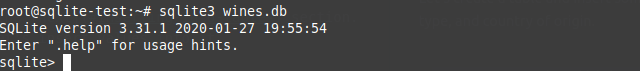
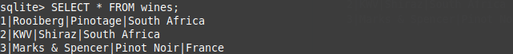
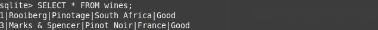
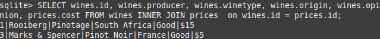

## How To Install and Use SQLite on Ubuntu 20.04

### Introduction

SQLite is a free, cross-platform database management system. It is popular for its efficiency and ability to be used with many different programming languages. This article will teach you how to:

- Create a database
- Read data
- Insert items into your database
- Delete items from your database
- Join items from separate databases

## Prerequisites

Ubuntu 20.04

## Installing SQLite on Ubuntu 20.04

To install the SQLite command-line interface on Ubuntu:

```
sudo apt-get update
sudo apt-get install sqlite3 

```

## Creating your database

We will be creating a database containing different wines and their attributes. To create a database, run the command:

```
sqlite3 wines.db
```

Where 'wines' is the name of your database. If the file `wines.db` already exists, SQLite will open a connection to it; if it does not exist, it will be created. 

After creating your database, your terminal will look like:




## Creating a table

SQLite databases are organized with tables. Tables store information. To better visualize a table, one can imagine rows and columns.

The rest of this tutorial will follow a common convention for entering SQLite commands. SQLite commands are capitalized and user information is lowercase. Lines **must** end with a semi-colon.

Now let's create a table and insert some data. This table named "wines" has four columns: 

- An ID
- The wines' producer 
- Type (of wine)
- Country of origin. 

```
CREATE TABLE wines(id integer NOT NULL, producer text NOT NULL, winetype text NOT NULL, origin text NOT NULL); 
```

We will talk about "NOT NULL" in the [next](#inserting-into-tables) section. Now we have created a table. Let's insert values into it. 

### Inserting into tables

To insert into a table, the command follows the form:
`INSERT INTO tablename VALUES(values go here);`

Where tablename is the name of your table, and values are within parentheses.

Let's insert values into our "wines" table:

```
INSERT INTO wines VALUES (1, "Rooiberg", "Pinotage", "South Africa");
INSERT INTO wines VALUES (2, "KWV", "Shiraz", "South Africa");
INSERT INTO wines VALUES (3, "Marks & Spencer", "Pinot Noir", "France");
```

Because we specified "NOT NULL" for each of the variables in our table, one must enter a value for each. For example, if we added another wine without setting its origin:

`INSERT INTO wines VALUES (4, "Le Pin", "Pomerol");`

We will receive an error:


## Reading tables

We will focus on the most basic methods of reading data from a table. SQLite provides more specific methods to view data in tables. 

To view our table with all of the inserted values, type:

`SELECT * FROM wines;`

You will see the previously inserted entries:


To view by ID (The values we set manually), type:

`SELECT * FROM wines WHERE id IS 1;`


Breaking this down:

1. We select all (*) values from our database, wines.
2. Look at all "id" values.
3. Return all table entries where id is equal to 1. 

Now that we can insert and view data in our tables, let's look at updating an existing table.

## Updating tables
In the following sections we will learn how to:

- Add new columns into tables 
- Updating existing values in tables

### Adding columns 
SQLite3 allows you to change values within your tables. This means creating new rows and columns or modifying existing rows in columns. 

"ALTER TABLE" can be used to create a new column. Let's try creating a new column, indicating our opinion of the wines.


`ALTER TABLE wines ADD COLUMN opinion text;`
 

Here, we add a new column with the name "opinion", of the text type. Now, let's add our opinion to each wine.

### Updating values  


Using the UPDATE command, we can modify information within our database. Currently, our opinion column has no values stored in it. Let's change that. 

```
 UPDATE wines SET opinion = "Good" WHERE id=1;
 UPDATE wines SET opinion = "Bad" WHERE id=2;
 UPDATE wines SET opinion = "Good" WHERE id=3;
```

If you type `SELECT * FROM wines;`, you will see the updated values.


## Deleting information

With "DELETE" We can delete rows from our database. Let's delete the wine from our database where our opinion of it is "Bad".

`DELETE FROM wines WHERE opinion IS "Bad";`

Typing `SELECT * FROM wines;` will verify that the row has been deleted.



## Joining

What if we had two tables, our current wines table, and a "prices" table, where the prices table has an id value that maps to our wines table, and a "cost" value, which indicates the cost of the wine? 

If we wanted to query data from both tables, we can use one of four join commands:
- INNER JOIN
- OUTER JOIN
- LEFT JOIN
- CROSS JOIN

We will focus on the "INNER JOIN" command. Inner join allows us to combine rows from two different tables. For further reading on the different join commands, go to the [further reading section](#further-reading). 

Let's create our "prices" table.

```
CREATE TABLE prices (id integer NOT NULL, cost text NOT NULL);
 INSERT INTO prices VALUES (1,"$15");
 INSERT INTO prices VALUES (3, "$5");
```

We can now join our two tables, where each prices id matches the proper id in the "wines" table by:

`SELECT * FROM wines INNER JOIN prices on wines.id = prices.id;`

Your output will look like this:


Note that the id value from prices has also been included in the output. You can specify which output you wish to see by:

```
SELECT wines.id, wines.producer, wines.winetype, wines.origin, wines.opinion, prices.cost FROM wines INNER JOIN prices  on wines.id = prices.id;
```



## Conclusion

SQLite is a useful tool for database management. One can quickly create a database, and manipulate it with various commands. Following this tutorial, you now have a basic command of SQLite3, and can now [dive deeper](#further-reading) into this database management system.


## Further reading

For help with syntax, [the official documentation is full of diagrams like this one](http://www.SQLite.org/lang_delete.html).

If you would like to learn more about different join commands, [here is a link to a tutorial with an overview of each type of join](http://zetcode.com/db/SQLite/joins/).

SQLite has wrappers and drivers in all the major languages and runs on most systems. [A list of many of them can be found here](http://www.SQLite.org/cvstrac/wiki?p=SQLiteWrappers").
